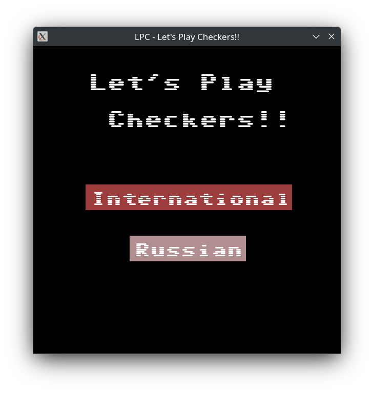
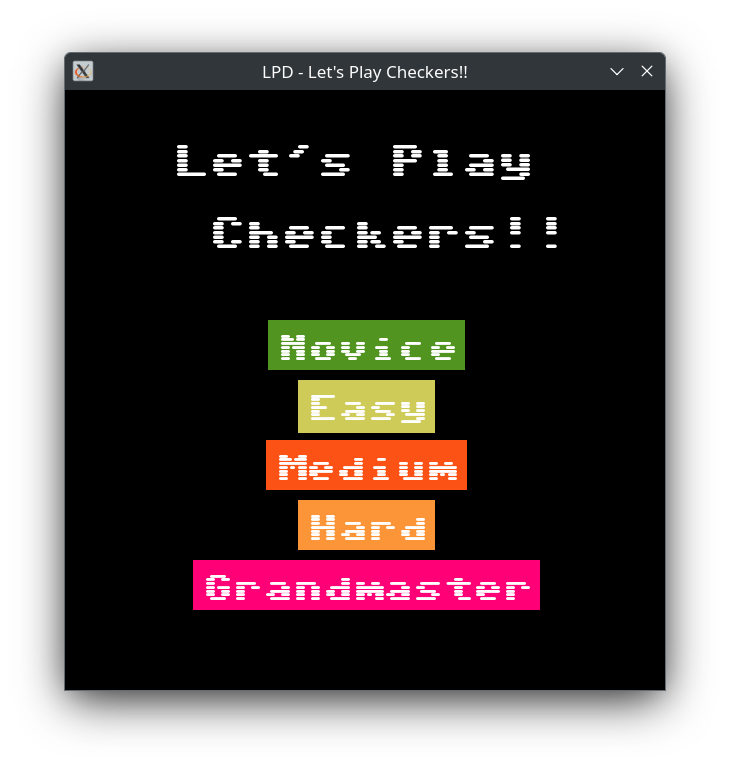
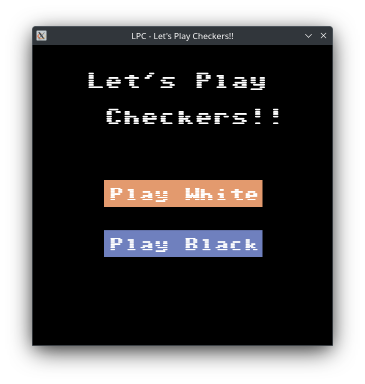
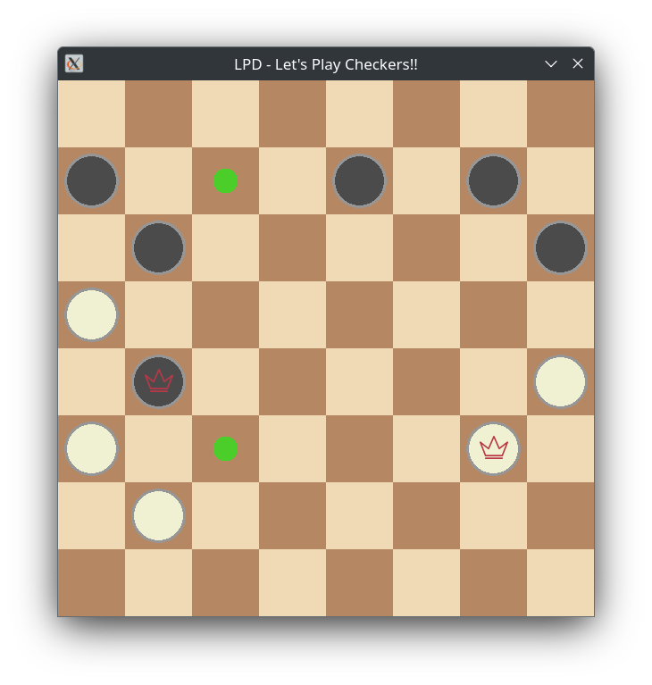
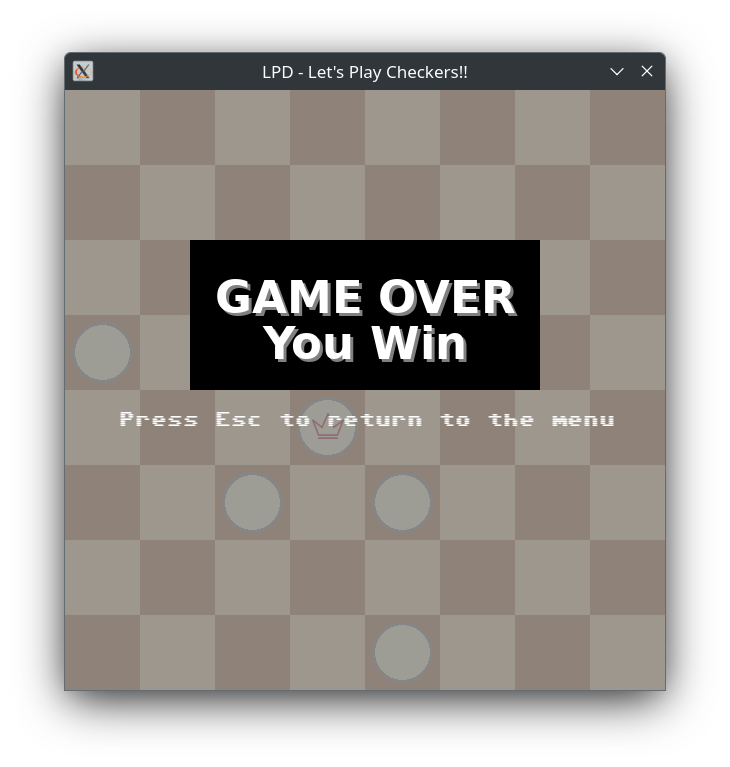

# LPC -  Let's Play Checkers!!

A classic Checkers (Draughts) game written in modern C++20, featuring both local two-player mode and various AI opponents, rendered with SFML.<br/>
The following checkers variants are supported:
- **International**
- **Russian**
- **Canadian**
- **Brazilian**

---

## Features

- **Board Logic**  
  - Board with automatic move generation and capture rules.  
  - Piece promotion (regular to queen) at the opposite side.  
  - Chained captures supported (multiple jumps in one turn).  

- **AI Engines**  
  - **Random Engine**: Picks a random valid move.  
  - **Minimax Engine**: Employs the Minimax algorithm (with Alpha-Beta pruning) with variable difficulty levels (`EASY`, `MEDIUM`, `HARD`, `GRANDMASTER`).  

- **GUI**  
  - SFML-based user interface with clickable squares.  
  - Menu system to select either two-player or computer-vs-human mode, as well as difficulty/AI level.  
  - Resizable game window with a `600x600` minimum size; board, buttons, fonts, and result screens adapt to the current window size.  
  - Visual highlights for valid moves, chain captures, and game result screens.  
  - Undo/Redo support (`Ctrl+Z` / `Cmd+Z`, `Ctrl+Y` / `Cmd+Shift+Z`).  

- **State Machine**  
  - Easily extendable system to manage game states (Menu, Play, etc.).  

---
## Some screenshots


<div style="display: flex; justify-content: center;">
  
  
</div>


<div style="display: flex; justify-content: center;">
  
  
</div>

<div style="display: flex; justify-content: center;">

  
</div>

---

## Architecture Overview

This project is split into three main parts:

1. **Checkers-logic**
   - **`Checkers`** class: Handles all move logic, captures, piece promotion, and maintains the turn order. Stores **Board**
   - **`Board`** class: Maintains 8×8 (Russian and Brazilian), 10×10 (International) and 12×12 (Canadian) grid using space-efficient std::array.
   - Exposes functions for retrieving valid moves, making moves, and resetting the board.
   - Tracks game result and winner determination.

2. **Engine**  
   - **`Engine`** is an abstract base class providing a `getBestMove()` method.  
   - **`RandomEngine`**: Returns a random valid move.  
   - **`MinimaxEngine`**: Implements a Minimax search. Different difficulty levels limit the search depth. Implemented Alpha-Beta pruning. Added a random component when choosing the optimal move to minimize the probability of getting exactly the same games.
   - Uses an evaluation function in `EvaluationFunction.cpp` to score board states.

3. **GUI**  
   - **SFML**-driven interface in the `gui` directory.  
   - **`StateManager`**: Maintains a stack of states.  
   - **`MenuState`**: Lets user select mode (two-player or vs. AI), color for player, and AI difficulty.  
   - **`PlayState`**: Renders the board, pieces, handles user input, and orchestrates moves from the chosen `Engine`.  
   - **`ResourceManager`**: Loads and provides textures and fonts.  
   - **`Button`**: Simple clickable UI element.  
<br/>

### Notable Design Patterns

- **Strategy Pattern**  
  - `Engine` as the strategy interface; `RandomEngine` and `MinimaxEngine` as concrete implementations.
  
- **State Pattern**  
  - `StateManager` switches between different GUI states (`MenuState`, `PlayState`).

- **Factory/Builder-Like**  
  - Creation of specific engines (`ENGINE_MODE` → `RandomEngine` or `MinimaxEngine`) depending on user choice.

- **Observer-Like**  
  - While not a strict observer pattern, the GUI “observes” changes in the `Board` state by calling `Board::getResult()` and re-rendering accordingly.

<br/>

### Core Algorithms

- **Move Generation**  
  - Generates valid moves using `Board::generateValidMoves()`.  
  - Forces capture moves if any are available (as in checkers rules).  
  - Supports piece promotion and chain captures.

- **Minimax with Depth (with Alpha-Beta pruning)**  
  - Evaluates board states up to a maximum depth (`EASY = 2`, `MEDIUM = 4`, etc.)  
  - Scores positions using `evaluatePosition()` for piece advantage and positional bonuses.  

---

## Getting Started

1. **Clone the Repository**
2. **Build Requirements**
   - C++20 compiler
   - CMake `>= 3.25.1`
   - SFML `>= 3.0`

### Recommended: Build with vcpkg (Linux/macOS/Windows)

This is the same approach used in CI and is the most consistent across platforms.

#### Linux (Ubuntu)

Install toolchain and native dependencies:
```bash
sudo apt-get update
sudo apt-get install -y \
  git cmake ninja-build g++ pkg-config \
  libx11-dev libxrandr-dev libxcursor-dev libxi-dev libudev-dev \
  libgl1-mesa-dev libfreetype-dev libopenal-dev libflac-dev libvorbis-dev
```

Build:
```bash
git clone https://github.com/microsoft/vcpkg.git
./vcpkg/bootstrap-vcpkg.sh -disableMetrics
./vcpkg/vcpkg install sfml:x64-linux

cmake -S . -B build -G Ninja \
  -DCMAKE_BUILD_TYPE=Release \
  -DCMAKE_TOOLCHAIN_FILE="$PWD/vcpkg/scripts/buildsystems/vcpkg.cmake" \
  -DVCPKG_TARGET_TRIPLET=x64-linux
cmake --build build --parallel
./build/LPC
```

#### macOS

Build:
```bash
git clone https://github.com/microsoft/vcpkg.git
./vcpkg/bootstrap-vcpkg.sh -disableMetrics

# Apple Silicon:
./vcpkg/vcpkg install sfml:arm64-osx

# Intel Mac (use this instead):
# ./vcpkg/vcpkg install sfml:x64-osx

cmake -S . -B build -G Ninja \
  -DCMAKE_BUILD_TYPE=Release \
  -DCMAKE_TOOLCHAIN_FILE="$PWD/vcpkg/scripts/buildsystems/vcpkg.cmake" \
  -DVCPKG_TARGET_TRIPLET=arm64-osx
cmake --build build --parallel
./build/LPC
```

#### Windows (PowerShell)

Build:
```powershell
git clone https://github.com/microsoft/vcpkg.git
.\vcpkg\bootstrap-vcpkg.bat -disableMetrics
.\vcpkg\vcpkg.exe install sfml:x64-windows

cmake -S . -B build -A x64 `
  -DCMAKE_TOOLCHAIN_FILE="$pwd/vcpkg/scripts/buildsystems/vcpkg.cmake" `
  -DVCPKG_TARGET_TRIPLET=x64-windows
cmake --build build --config Release --parallel
.\build\Release\LPC.exe
```

### Linux Without vcpkg

#### Option A: System packages (if your distro provides SFML 3)

On Debian/Ubuntu-like systems:
```bash
sudo apt-get update
sudo apt-get install -y cmake g++ pkg-config libsfml-dev

cmake -S . -B build -DCMAKE_BUILD_TYPE=Release
cmake --build build --parallel
./build/LPC
```

If CMake reports SFML 2.x from distro packages, use Option B.

#### Option B: Build SFML 3 from source

```bash
sudo apt-get update
sudo apt-get install -y \
  git cmake ninja-build g++ pkg-config \
  libx11-dev libxrandr-dev libxcursor-dev libxi-dev libudev-dev \
  libgl1-mesa-dev libfreetype-dev libopenal-dev libflac-dev libvorbis-dev

git clone --branch 3.0.2 --depth 1 https://github.com/SFML/SFML.git
cmake -S SFML -B SFML/build -G Ninja -DCMAKE_BUILD_TYPE=Release -DSFML_BUILD_EXAMPLES=OFF
cmake --build SFML/build --parallel
sudo cmake --install SFML/build

cmake -S . -B build -DCMAKE_BUILD_TYPE=Release
cmake --build build --parallel
./build/LPC
```

### macOS Without vcpkg (Homebrew)

```bash
brew install cmake sfml
cmake -S . -B build -DCMAKE_BUILD_TYPE=Release
cmake --build build --parallel
./build/LPC
```

---

## Usage

1. Launch the game — a window will open with the main menu.
2. Select Checkers type (`International`, `Russian`, `Canadian`, `Brazilian`).
3. Select Game Mode — either play against the computer (`With Computer`) or another human locally (`Two Players`).
4. (Computer mode only) Choose Your Colour — play as White or Black.
5. (Computer mode only) Select Difficulty — choose from `Novice`, `Easy`, `Medium`, `Hard`, or `Grandmaster`.
6. Enjoy playing — click the squares to select a piece and move it. Possible moves are highlighted automatically.
7. Use `Ctrl+Z` (`Cmd+Z` on macOS) to undo, and `Ctrl+Y` (or `Ctrl+Shift+Z` / `Cmd+Shift+Z`) to redo.
8. Resize or maximize the window as needed; the board remains centered and the UI scales with the window.
9. Press `ESC` anytime to return to the main menu.

---

## TODO
1. ~~**Implement Undo / Redo**~~ Done!
    - ~~Track and revert moves for convenience.~~

2. **Improve AI**
    - Implement a transposition table or caching.
    - Add multithreading (`Grandmaster` mode can be faster).

3. **Online Multiplayer**
    - Introduce network play for remote two-player matches.

4. **UI Enhancements**
    - ~~Turn the board around if playing for black against the computer.~~ Done! 🎊
    - Animate piece captures more smoothly.
    - Add sounds and a game timer.

5. **Automated Testing**
    - Add unit tests for critical Board methods and engine functionality.

6. **Add Documentation**
