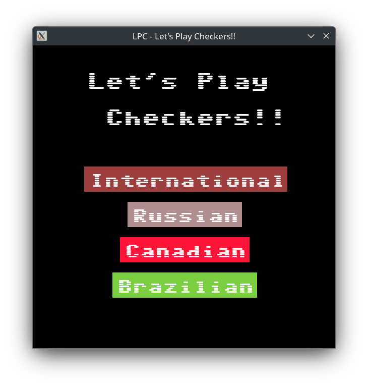
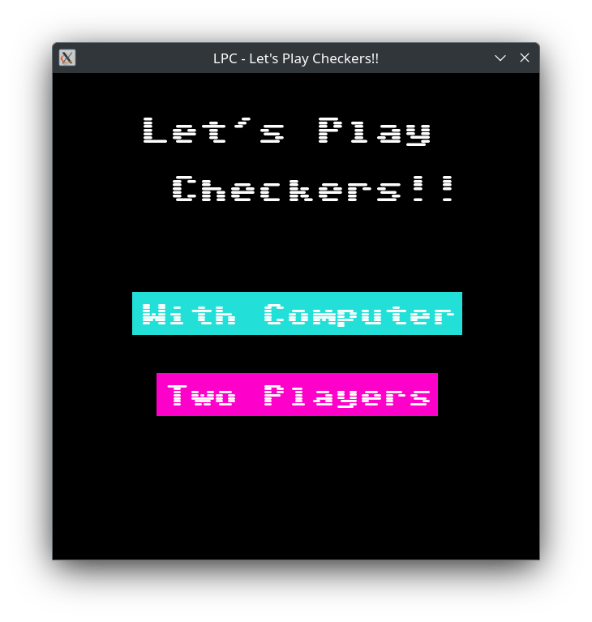
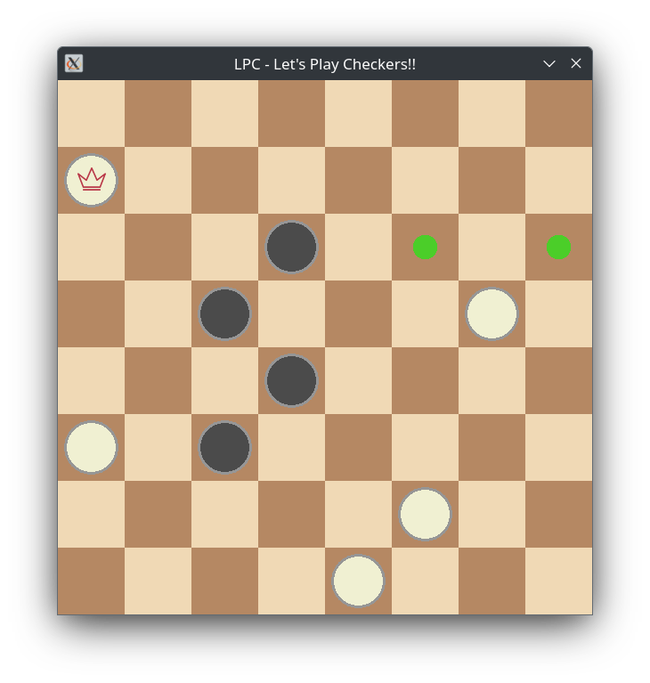
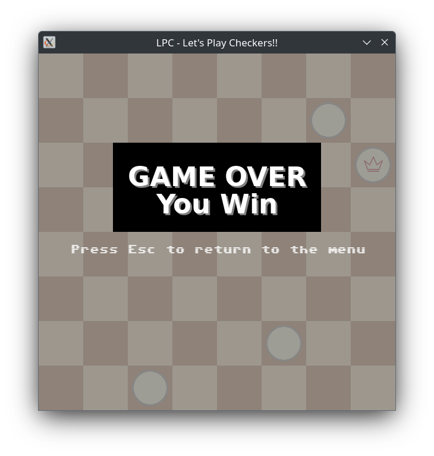

# LPC -  Let's Play Checkers!!

A classic Checkers (Draughts) game written in modern C++20, featuring both local two-player mode and various AI opponents, rendered with SFML.<br/>
The following checkers variants are supported:
- **International**
- **Russian**
- **Canadian**
- **Brazilian**

---

## Features

- **Board Logic**  
  - Board with automatic move generation and capture rules.  
  - Piece promotion (regular to queen) at the opposite side.  
  - Chained captures supported (multiple jumps in one turn).  

- **AI Engines**  
  - **Random Engine**: Picks a random valid move.  
  - **Minimax Engine**: Employs the Minimax algorithm (with Alpha-Beta pruning) with variable difficulty levels (`EASY`, `MEDIUM`, `HARD`, `GRANDMASTER`).  

- **GUI**  
  - SFML-based user interface with clickable squares.  
  - Menu system to select either two-player or computer-vs-human mode, as well as difficulty/AI level.  
  - Visual highlights for valid moves, chain captures, and game result screens.  

- **State Machine**  
  - Easily extendable system to manage game states (Menu, Play, etc.).  

---
## Some screenshots


<div style="display: flex; justify-content: center;">
  
  
</div>


<div style="display: flex; justify-content: center;">
  
  
</div>

<div style="display: flex; justify-content: center;">

  
</div>

---

## Architecture Overview

This project is split into three main parts:

1. **Checkers-logic**
   - **`Checkers`** class: Handles all move logic, captures, piece promotion, and maintains the turn order. Stores **Board**
   - **`Board`** class: Maintains 8×8 (Russian and Brazilian), 10×10 (International) and 12×12 (Canadian) grid using space-efficient std::array.
   - Exposes functions for retrieving valid moves, making moves, and resetting the board.
   - Tracks game result and winner determination.

2. **Engine**  
   - **`Engine`** is an abstract base class providing a `getBestMove()` method.  
   - **`RandomEngine`**: Returns a random valid move.  
   - **`MinimaxEngine`**: Implements a Minimax search. Different difficulty levels limit the search depth. Implemented Alpha-Beta pruning. Added a random component when choosing the optimal move to minimize the probability of getting exactly the same games.
   - Uses an evaluation function in `EvaluationFunction.cpp` to score board states.

3. **GUI**  
   - **SFML**-driven interface in the `gui` directory.  
   - **`StateManager`**: Maintains a stack of states.  
   - **`MenuState`**: Lets user select mode (two-player or vs. AI), color for player, and AI difficulty.  
   - **`PlayState`**: Renders the board, pieces, handles user input, and orchestrates moves from the chosen `Engine`.  
   - **`ResourceManager`**: Loads and provides textures and fonts.  
   - **`Button`**: Simple clickable UI element.  
<br/>

### Notable Design Patterns

- **Strategy Pattern**  
  - `Engine` as the strategy interface; `RandomEngine` and `MinimaxEngine` as concrete implementations.
  
- **State Pattern**  
  - `StateManager` switches between different GUI states (`MenuState`, `PlayState`).

- **Factory/Builder-Like**  
  - Creation of specific engines (`ENGINE_MODE` → `RandomEngine` or `MinimaxEngine`) depending on user choice.

- **Observer-Like**  
  - While not a strict observer pattern, the GUI “observes” changes in the `Board` state by calling `Board::getResult()` and re-rendering accordingly.

<br/>

### Core Algorithms

- **Move Generation**  
  - Generates valid moves using `Board::generateValidMoves()`.  
  - Forces capture moves if any are available (as in checkers rules).  
  - Supports piece promotion and chain captures.

- **Minimax with Depth (with Alpha-Beta pruning)**  
  - Evaluates board states up to a maximum depth (`EASY = 2`, `MEDIUM = 4`, etc.)  
  - Scores positions using `evaluatePosition()` for piece advantage and positional bonuses.  

---

## Getting Started

1. **Clone the Repository**
2. **Build** (Developed on Debian 12)<br/>Make sure you have a C++20 compiler and CMake ≥ 3.25.1 installed, plus SFML (version ≥ 2.5).
```bash
mkdir -p build && cd build && cmake -DCMAKE_BUILD_TYPE=Release .. && make
```
3. **Run**
```bash
./LPC
```

---

## Usage

1. Launch the game — a window will open with the main menu.
2. Select Checkers type (`International`, `Russian`, `Canadian`, `Brazilian`).
3. Select Game Mode — either play against the computer (`With Computer`) or another human locally (`Two Players`).
4. (Computer mode only) Choose Your Colour — play as White or Black.
5. (Computer mode only) Select Difficulty — choose from `Novice`, `Easy`, `Medium`, `Hard`, or `Grandmaster`.
6. Enjoy playing — click the squares to select a piece and move it. Possible moves are highlighted automatically.
7. Press `ESC` anytime to return to the main menu.

---

## TODO
1. **Implement Undo / Redo**
    - Track and revert moves for convenience.

2. **Improve AI**
    - Implement a transposition table or caching.
    - Add multhithreading (`Grandmaster` mode can be faster).

3. **Online Multiplayer**
    - Introduce network play for remote two-player matches.

4. **UI Enhancements**
    - Turn the board around if playing for black against the computer.
    - Animate piece captures more smoothly.
    - Add sounds and a game timer.

5. **Automated Testing**
    - Add unit tests for critical Board methods and engine functionality.

6. **Add Documentation**